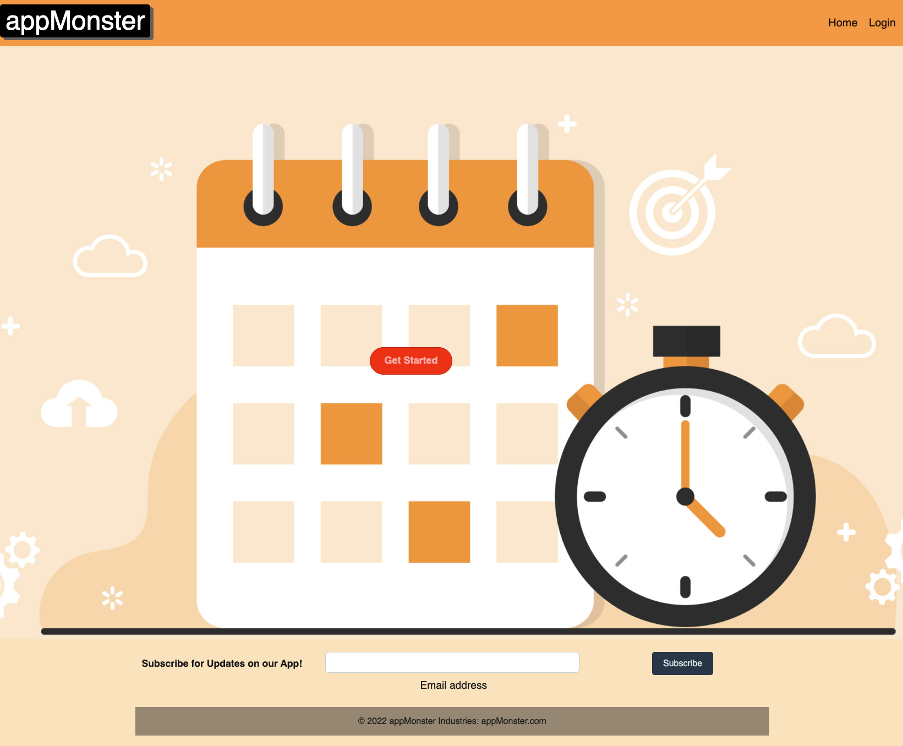
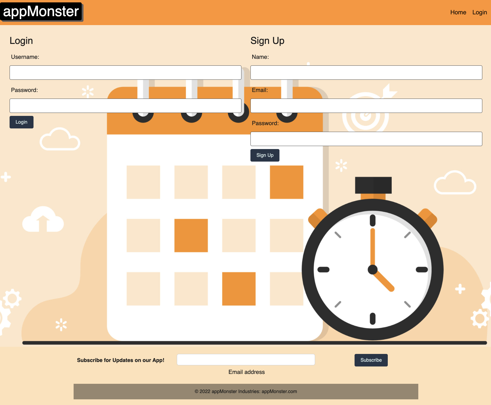
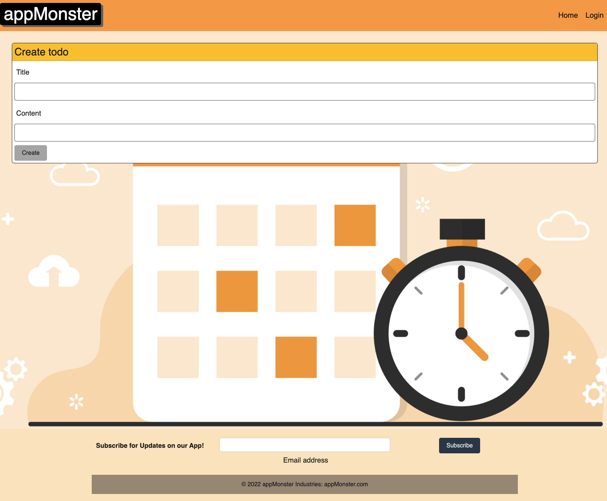
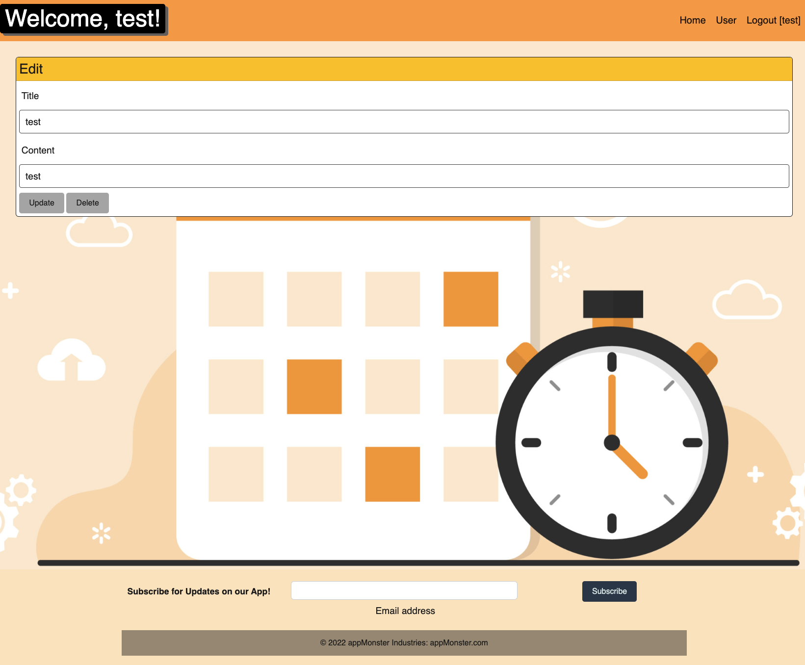

# Family to do list

<p> 
    
    
    
    
    
    
    
    
    
</p>


## Table of Contents
1. [Description](#description)
2. [User Story](#user-story)
3. [Screenshot](#screenshot)
4. [Heroku](#heroku)
5. [Installation](#installation)
6. [License](#license)
7. [Contributing](#contributing)
8. [Test](#test)
9. [Questions](#contact-information)

## Description
Built a todo list website so that user could keep tracker of their todos. The app is available on [Heroku](https://intense-plains-44092.herokuapp.com/). The app will follow the MVC paradigm in its architectural structure, using Handlebars.js as the templating language, Sequelize as the ORM, and the express session npm package for authentication

## User Story
```md
AS A developer who wants to keep track of todos
I WANT a todo-list site
SO THAT I can post, save, update, and delete my todos
```

## Screenshot









# Heroku
Check out the live application in [Heroku](https://intense-plains-44092.herokuapp.com/)


## Installation
To clone the repo:
```
git clone https://github.com/shelldan/appMonster.git
``` 
Run 'npm install' to install dependencies

Run 'mysql.server start' to start MySQL

Run 'mysql -u root -p' to connect MySQL

Run 'SOURCE db/schema.sql;' to load the database

Run 'npm seed' to plant the seed

Run 'npm nodemon' to start the program

---

## License
[](https://opensource.org/licenses/MIT) 

## Contributing 
To contribute to this application, create a pull request.
Here are the steps needed for doing that:
- Fork the repo
- Create a feature branch (git checkout -b NAME-HERE)
- Commit your new feature (git commit -m 'Add some feature')
- Push your branch (git push)
- Create a new Pull Request

Following a code review, your feature will be merged.

---

## Test:
This is no test available for now

---

## Contact Information
* [Robert Barnes](https://github.com/okingdomz)
* [Xiao Li](https://github.com/shelldan)
* [William Krumbach](https://github.com/krumbelievable)
* [Michael Alvarado](https://github.com/Michael-Alvarado)
* [Zinia Quintanilla](https://github.com/ZiniaQ)
